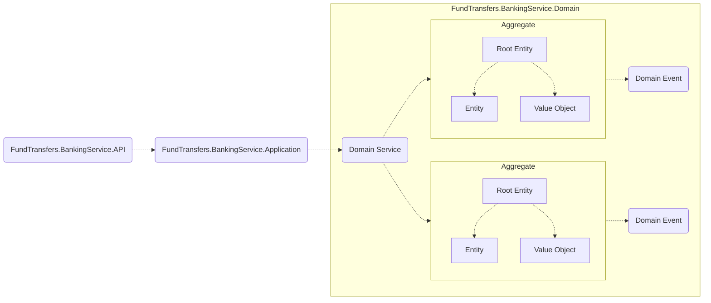
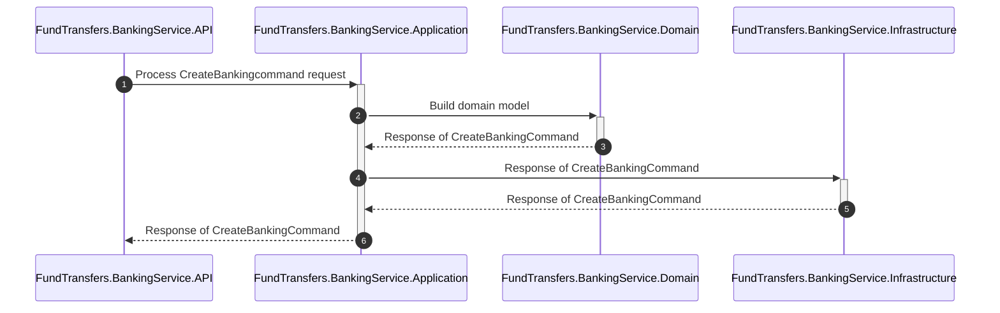

# FundTransfers

## Index

- [Overview](#overview)
- [Project Folder Structure](#project-folder-structure)
- [Solution Structure](#solution-structure)
- [Standardized Architecture Patterns](#standardized-architecture-patterns)
- [Building Blocks](#building-blocks)
- [Get Started - Run Microservice](#getting-started)
- [DDD Implementation Guide](#ddd-implementation-guide)
- [Sequence Flow](#sequence-flow)

## Overview

`FundTransfers` is a ASP.NET Core Web API project designed using DDD (Domain Driven Design) approach.

> This project was created using Inizio - Dotnet Starterkit (Powered by Neudesic, an IBM Company)

## Project Folder Structure
- `dapr` - This folder contains the dapr related component(s)
- `deploy` - This folder contains the deployment script(s)
- `src` - This folder contains the source project(s) and related file(s)
- `README.md` - Project Readme content

## Solution Structure
- `FundTransfers.BankingService.API` - Web API Project which contains the ASP.Net Web API core file(s) e.g. Controllers, Middleware configurations etc
- `FundTransfers.BankingService.Application` - Application Layer which contains Core Business Logic, Commands, Queries etc
- `FundTransfers.BankingService.Domain` - Domain Layer which contains Aggregate Models, Events etc
- `FundTransfers.BankingService.Infrastructure` - Infrastructure Layer which contains External Infrastructure integrations e.g. DB using Entity Framework Core, Event Bus etc
- `FundTransfers.BankingService.Tests` - Unit Tests project which contains tests

## Standardized Architecture Patterns

Below are the standardized patterns which are followed in this solution:
- `Clean (Onion) Architecture` - API, Application Core, Domain & Infrastructure
- `Domain Driven Design` - Domain, Aggregates, Entities, Value Objects
- `Ports & Adaptors` - Standardized Contracts and Service Implementations
- `MediatR Pattern` - Command (Write) Query (Read) Responsibility Seperation
- `Repositories` - For DB interactions

## Building Blocks

When building application each building block make use of different service as listed below.

| Building Blocks    | Service                   |
|--------------------|---------------------------|
| Service Invocation | Grpc                 |
| State Store        | Redis                     |
| Pub Sub            | Apache Kafka                     |
| Tracing            | Zipkin                    |
| Secret Store       | local file/Azure Keyvault |
| Config Store       | Redis                     |

## Getting Started

Follow below steps to get started with FundTransfers - Web API:

### Prerequisites

Make sure to install the following softwares on your development machine before consuming the template:

- .NET 7 SDK - [Download .NET 7 SDK](https://dotnet.microsoft.com/en-us/download/dotnet/7.0)
- Visual Studio 2022 - [Download Visual Studio](https://visualstudio.microsoft.com/vs/) OR Visual Studio Code [Download VS Code](https://code.visualstudio.com/download)
- Docker Desktop - [Download Docker Desktop](https://www.docker.com/products/docker-desktop/)
- SQL Server - [Download SQL Server](https://microsoft.com/en-in/sql-server/sql-server-downloads)
- Dapr* - [Download Dapr CLI](https://docs.dapr.io/getting-started/install-dapr-cli/)
- Helm - [Install helm](https://helm.sh/docs/intro/install/)

\* - If you want to use the dapr version of the code.

### Configuring SQL Database (EF Code First Approach)

### Note: Required If you have made any modification to the entities, else skip this step for now.

Assuming you are at the root folder created by the template and the project name is `Neudesic.InizioBanking`, run below commands:

```pwsh
if (dotnet tool list -g | where { $_ -Match '^dotnet-ef'}) {
  dotnet tool update --global dotnet-ef
} else {
  dotnet tool install --global dotnet-ef
}
$connectionString = "<PUT-YOUR-LOCALHOST-DB-CONNECTIONSTRING>"
pushd src\Neudesic.InizioBanking.MyBankingService\Neudesic.InizioBanking.MyBankingService.Infrastructure
dotnet ef migrations add Initial-Migration -o Migrations
dotnet ef database  update --connection $connectionString
popd
```

- Verify that the database has been updated.

### Run the Microservice using Docker Compose

### Using Command Line

> **Note:** You need to update Web API project - `appsettings.json` file with relevant configurations e.g. connection strings, app insights, azure ad settings etc.

Use below commands from the project root directory using any command line tool (e.g. Command Prompt, Windows Terminal)

To run application using docker-compose:

#### Using Commandline:

```powershell
docker-compose build
docker-compose up
```

#### Using Visual Studio:

- Open `FundTransfers.Context.sln` solution in Visual Studio
- Set `docker-compose` as startup project
- `Build` & `Run` the solution to start the microservice


To run application using tye:


You should be able to browse the Microservice by using the below URL, if there is no change to the port:

[http://localhost:5001/swagger/index.html](http://localhost:5001/swagger/index.html)


### Deploy to local k8s using helm chart
Before you deploy to application to local k8s make sure you have completed the following steps:
  - Enable k8s mode in docker desktop.
  - Build the service image for docker using the `build-docker-image.ps1` script in each service folder.
  - If you are using dapr version of code run `dapr init -k` to initiate the dapr services for k8s.
  - Install ingress controller to access the services inside k8s using helm.
  ```
  helm upgrade --install ingress-nginx ingress-nginx `
  --repo https://kubernetes.github.io/ingress-nginx `
  --namespace ingress-nginx --create-namespace
  ```
  - **NOTE:** If you are using apache kafka make sure you install kafka using below commands (Only required when you are using apache kafka with non-dapr template).
  ```
  helm repo add bitnami https://charts.bitnami.com/bitnami
  helm install kafka bitnami/kafka
  ```
  Once you have completed to above steps, navigate to the `deploy\k8s\helm` folder and make changes to the `values.yaml`, if required.
  
  IN NON-DAPR MODE: Make sure you have updated the `appsettings.json` file in `deploy\k8s` with correct keyvault config. (Just keyvault config is enough, it will read all other secrets from AKV)
  
  Then execute the following powershell script. It will automatically deploy your application `redis` and `zipkin` to the k8s.
  ```
  .\deploy-to-local-k8s.ps1
  ```

  If you are using the k8s secret store, make sure you have created the secrets beforehand. For example:

  ```
  kubectl create secret generic demo-secret --from-literal=demo-secret="Hello from k8s" -n <NAMESPACE_FROM_VALUES.YAML>
  kubectl create secret generic <YOUR_SERVICE_NAME>-connectionstring --from-literal=<YOUR_SERVICE_NAME>-connectionstring="Server=localhost;Database=BankingDb;User Id=sa;Password=sadmin@123;TrustServerCertificate=True;" -n <NAMESPACE_FROM_VALUES.YAML>
  ```

  You can cleanup the resources using, 
  ```
  .\remove-from-local-k8s.ps1
  kubectl delete -f .\redis.yaml
  kubectl delete -f .\zipkin.yaml
  ```

  Remove dapr related resources if any using,
  ```
  dapr uninstall -k
  ```

## DDD implementation guide

This project uses Domain Driven Design approach. Each layer has got logical bounderies.
 
>  **Note:**
> 
>  Domain Service would need, when there is a domain logic spawn across two or more aggregates.
    


To create Root entity, you must inherit from entity and IAggregateRoot
```csharp    
    public class Root : Entity, IAggregateRoot
    {

    }
```

## Sequence Flow

 Sequence flow diagram for CreateBankingCommand flow 


